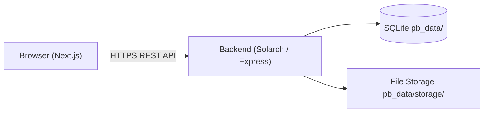

# TaskNest

A full-stack Kanban task board built with Next.js and [Solarch](https://github.com/xvertere-org/Solarch) — a PocketBase-inspired TypeScript backend-as-a-service for Node.js.

---

## Overview

TaskNest lets you organize work into **workspaces → boards → lists → tasks**. It is a single-repository project with a self-hosted REST API backend and a React frontend deployed separately.

The backend is entirely schema-driven: collections, fields, and access rules are provisioned via API scripts at startup and are persisted in SQLite. No ORM migrations, no manual SQL.

The project was built to explore Solarch as a backend framework. Known framework issues discovered during development are documented in [`docs/PACKAGE-ISSUES.md`](docs/PACKAGE-ISSUES.md).

---

## Features

- **User accounts** — email/password registration and login, JWT-based sessions persisted in `localStorage`
- **Workspaces** — create isolated project spaces; each workspace is owned by one user
- **Kanban boards** — multiple boards per workspace
- **Lists** — ordered columns within a board
- **Tasks** — create, move between lists, add descriptions, set due dates, upload a single file attachment per task
- **Task detail modal** — edit description, move to a different list, delete task, upload/view attachment
- **Auto-bootstrap** — on server start, required collections and access rules are created automatically if they do not exist
- **Persistent storage** — SQLite database on a mounted disk; data survives server restarts

**Known limitations (workarounds in place):**
- JS hooks (`onRecordCreate`, `onRecordDelete`) do not fire in Solarch 0.15.6 due to upstream bugs. Cascade deletes and auto-membership are handled client-side instead.
- Relation-based access rules cannot be evaluated at this Solarch version. Access rules use a simple `@request.auth.id != ''` guard and ownership is filtered client-side.

---

## Tech Stack

| Layer        | Technology                               |
|--------------|------------------------------------------|
| Frontend     | Next.js 16, React 19, TypeScript 5       |
| Styling      | Tailwind CSS 4, custom CSS design system |
| Backend      | Node.js >= 20, Solarch 0.15.6            |
| Database     | SQLite (via Solarch / better-sqlite3)    |
| Auth         | JWT (issued by Solarch, stored in localStorage) |
| File storage | Local filesystem (via Solarch)           |
| Deployment   | Render (backend), Vercel (frontend)      |

---

## Architecture

```
tasknest/
├── backend/      — Solarch server (Node.js)
└── frontend/     — Next.js app
```



**Backend** (`backend/`): A thin `src/server.ts` entry point that starts a Solarch instance. On each startup, `src/auto-bootstrap.ts` connects to the running server's own API and ensures all six collections exist and their access rules are applied. Hook files in `pb_hooks/` document intended server-side logic that cannot currently run due to upstream bugs.

**Frontend** (`frontend/`): A Next.js App Router application. All API calls go through `src/lib/api.ts`, which attaches the JWT from `localStorage` to every request. The auth context (`src/contexts/auth-context.tsx`) restores the session from `localStorage` on mount. Routes: `/`, `/login`, `/register`, `/workspaces`, `/workspaces/[id]/boards`, `/boards/[id]`.

---

## Project Structure

```text
tasknest/
├── backend/
│   ├── src/
│   │   ├── server.ts             # Entry point
│   │   └── auto-bootstrap.ts    # Creates collections + rules on startup
│   ├── scripts/
│   │   ├── auth-helper.js        # Login helper used by all scripts
│   │   ├── setup-collections.js  # Manually provision collections
│   │   ├── setup-rules.js        # Manually set collection access rules
│   │   ├── reset-collections.js  # Delete all app collections
│   │   └── test-rules.js         # Smoke-test access rules
│   ├── pb_hooks/                 # JS hook files (informational; don't fire)
│   ├── pb_migrations/            # Solarch JS migration runner directory
│   ├── pb_public/
│   │   └── index.html            # Landing page served at /
│   ├── package.json
│   ├── tsconfig.json
│   ├── render.yaml               # Render deployment config
│   └── .env.example
├── frontend/
│   ├── src/
│   │   ├── app/
│   │   │   ├── page.tsx          # Landing page
│   │   │   ├── login/
│   │   │   ├── register/
│   │   │   ├── workspaces/
│   │   │   └── boards/[id]/
│   │   ├── contexts/
│   │   │   └── auth-context.tsx  # Global auth state
│   │   └── lib/
│   │       └── api.ts            # Typed fetch wrapper for all API calls
│   ├── package.json
│   ├── vercel.json
│   └── .env.local.example
├── docs/
│   └── PACKAGE-ISSUES.md         # Solarch bugs found during development
├── render.yaml                   # Root Render blueprint
└── .gitignore
```

---

## Prerequisites

- **Node.js** >= 20.0.0
- **npm** (bundled with Node.js)

No external database, Docker, or additional services are required to run locally.

---

## Installation

```bash
git clone https://github.com/ManasMishraAKaThunder/tasknest.git
cd tasknest
```

Install dependencies for both sub-projects:

```bash
cd backend && npm install
cd ../frontend && npm install
```

---

## Environment Variables

### Backend (`backend/.env`)

```bash
cp backend/.env.example backend/.env
```

| Variable               | Required | Description                                              | Example                         |
|------------------------|----------|----------------------------------------------------------|---------------------------------|
| `PORT`                 | No       | Port the server listens on. Defaults to `8090`.          | `8090`                          |
| `NODE_ENV`             | No       | `development` or `production`                            | `development`                   |
| `SOLARCH_JWT_SECRET`   | Yes      | Random string (>= 32 chars) used to sign JWTs           | `change_me_to_a_random_string`  |
| `ADMIN_EMAIL`          | Yes      | Email for the auto-created superuser account            | `admin@example.com`             |
| `ADMIN_PASSWORD`       | Yes      | Password for the superuser account                       | `StrongPassword123`             |
| `CORS_ALLOWED_ORIGINS` | No       | Comma-separated frontend origins. Empty = allow all.     | `http://localhost:3000`         |
| `DATA_DIR`             | No       | Directory where SQLite databases are stored. Defaults to `./pb_data`. | `./pb_data`   |

```dotenv
PORT=8090
NODE_ENV=development
SOLARCH_JWT_SECRET=replace_with_a_random_32_character_string
ADMIN_EMAIL=admin@example.com
ADMIN_PASSWORD=StrongPassword123
CORS_ALLOWED_ORIGINS=http://localhost:3000
```

### Frontend (`frontend/.env.local`)

```bash
cp frontend/.env.local.example frontend/.env.local
```

| Variable              | Required | Description                                              | Example                    |
|-----------------------|----------|----------------------------------------------------------|----------------------------|
| `NEXT_PUBLIC_API_URL` | No       | Base URL of the backend. Defaults to `http://localhost:8090`. | `http://localhost:8090` |

```dotenv
NEXT_PUBLIC_API_URL=http://localhost:8090
```

---

## Running Locally

### 1. Start the backend

```bash
cd backend
npm run dev
```

The server starts at `http://localhost:8090`. On first run, `auto-bootstrap` creates the superuser account and all collections automatically using `ADMIN_EMAIL` / `ADMIN_PASSWORD` from `.env`.

Visit `http://localhost:8090/_/` to access the Solarch admin dashboard.

### 2. Start the frontend

In a second terminal:

```bash
cd frontend
npm run dev
```

The app starts at `http://localhost:3000`.

### Backend scripts

| Command                     | Purpose                                       |
|-----------------------------|-----------------------------------------------|
| `npm run dev`               | Start development server with `tsx watch`     |
| `npm run build`             | Compile TypeScript to `dist/`                 |
| `npm start`                 | Run compiled output (`node dist/server.js`)   |
| `npm run setup:collections` | Manually provision collections via API        |
| `npm run setup:rules`       | Manually set access rules via API             |

### Frontend scripts

| Command         | Purpose                          |
|-----------------|----------------------------------|
| `npm run dev`   | Start Next.js dev server         |
| `npm run build` | Build production bundle          |
| `npm start`     | Start production Next.js server  |
| `npm run lint`  | Run ESLint                       |

---

## Usage

### Register and log in

1. Open `http://localhost:3000`
2. Click **Get Started** and create an account with email and password
3. You are redirected to the workspaces dashboard after registration

### Create a workspace

1. On the **Workspaces** page, type a name and click **+ Create**
2. The creator is automatically added as an `owner` member

### Work with tasks

1. Open a workspace, then open a board
2. Lists appear as Kanban columns — click **+ Add List** to create one
3. Click **+ Add a task** inside a column and press Enter
4. Click any task card to open the detail modal:
   - Edit the description
   - Move the task to a different list
   - Upload a file attachment (one per task)
   - Delete the task

---

## API Reference

The backend exposes the Solarch REST API at `/api/`. Authenticated endpoints require `Authorization: Bearer <token>`.

### Auth

| Method | Endpoint                                        | Auth | Description               |
|--------|-------------------------------------------------|------|---------------------------|
| POST   | `/api/collections/users/records`                | No   | Register a new user       |
| POST   | `/api/collections/users/auth-with-password`     | No   | Log in, returns JWT token |
| POST   | `/api/collections/users/auth-refresh`           | Yes  | Refresh the current token |

**Register**

```http
POST /api/collections/users/records
Content-Type: application/json

{
  "email": "user@example.com",
  "password": "yourpassword",
  "passwordConfirm": "yourpassword"
}
```

**Login**

```http
POST /api/collections/users/auth-with-password
Content-Type: application/json

{
  "identity": "user@example.com",
  "password": "yourpassword"
}
```

Response:

```json
{
  "token": "<jwt>",
  "record": {
    "id": "...",
    "email": "user@example.com",
    "displayName": "",
    "created": "...",
    "updated": "..."
  }
}
```

### Collections (authenticated)

| Method | Endpoint                                        | Description                              |
|--------|-------------------------------------------------|------------------------------------------|
| GET    | `/api/collections/workspaces/records`           | List workspaces                          |
| POST   | `/api/collections/workspaces/records`           | Create a workspace                       |
| DELETE | `/api/collections/workspaces/records/:id`       | Delete a workspace                       |
| GET    | `/api/collections/workspace_members/records`    | List workspace members                   |
| POST   | `/api/collections/workspace_members/records`    | Add a member to a workspace              |
| GET    | `/api/collections/boards/records`               | List boards (filter by workspace)        |
| POST   | `/api/collections/boards/records`               | Create a board                           |
| DELETE | `/api/collections/boards/records/:id`           | Delete a board                           |
| GET    | `/api/collections/lists/records`                | List lists (filter by board, sort by position) |
| POST   | `/api/collections/lists/records`                | Create a list                            |
| DELETE | `/api/collections/lists/records/:id`            | Delete a list                            |
| GET    | `/api/collections/tasks/records`                | List tasks (filter by list)              |
| POST   | `/api/collections/tasks/records`                | Create a task                            |
| PATCH  | `/api/collections/tasks/records/:id`            | Update a task                            |
| DELETE | `/api/collections/tasks/records/:id`            | Delete a task                            |

File attachments are uploaded via `PATCH` using `multipart/form-data` with field name `attachment`. The URL of a stored file is:

```
GET /api/files/tasks/:taskId/:filename
```

### Health

```
GET /api/health
```

Returns `200 OK` when the server is running. Used as the Render health check endpoint.

---

## Authentication & Authorization

- Registration is public — no invite required.
- Tokens are JWT, signed with `SOLARCH_JWT_SECRET`. They are stored in `localStorage` and attached to every API request.
- A `401` response from the API clears the stored token and redirects to `/login`.
- Access rules on all collections: `listRule`, `viewRule`, `updateRule`, `deleteRule` require `@request.auth.id != ''`. The `createRule` for `users` is empty (public registration).
- Workspace ownership is enforced client-side by filtering for records where `owner === currentUser.id`.

---

## Database

Solarch stores all data in two SQLite files:

| File                   | Contents                                  |
|------------------------|-------------------------------------------|
| `pb_data/data.db`      | Collections, records, superuser accounts  |
| `pb_data/auxiliary.db` | Auth tokens, revocations, sessions        |

The schema is managed through the Solarch collections API — there is no SQL written by hand. `auto-bootstrap` in `src/auto-bootstrap.ts` uses idempotent `ensureCollection` calls on every server start.

### Collections

| Collection          | Key fields                                                              |
|---------------------|-------------------------------------------------------------------------|
| `users` (auth)      | `email`, `password`, `displayName`                                      |
| `workspaces`        | `name` (text, required), `owner` (relation → users)                    |
| `workspace_members` | `workspace` (relation), `user` (relation), `memberRole` (owner/member) |
| `boards`            | `name` (text, required), `workspace` (relation)                        |
| `lists`             | `name` (text, required), `board` (relation), `position` (number)       |
| `tasks`             | `title` (text, required), `description` (editor), `list` (relation), `attachment` (file), `dueDate` (date) |

---

## Setup Scripts

If collections need to be re-provisioned on an existing server (for example, after a database reset), run:

```bash
# Local server
node backend/scripts/setup-collections.js
node backend/scripts/setup-rules.js

# Remote server (PowerShell)
$env:API_URL="https://your-backend.onrender.com"; node backend/scripts/setup-collections.js
$env:API_URL="https://your-backend.onrender.com"; node backend/scripts/setup-rules.js
```

These scripts read `ADMIN_EMAIL` and `ADMIN_PASSWORD` from `.env`. On a fresh database they call `POST /api/installer` to create the initial superuser, then authenticate normally.

To delete all app collections (the `users` collection is preserved):

```bash
node backend/scripts/reset-collections.js
```

---

## Deployment

### Backend → Render

The repository root includes a `render.yaml` Render Blueprint. Connect the GitHub repository on Render and it will be picked up automatically.

Manual steps:

1. Create a **Web Service** on [Render](https://render.com)
2. **Root Directory**: `backend`
3. **Build command**: `npm install`
4. **Start command**: `npx tsx src/server.ts`
5. **Health check path**: `/api/health`
6. Add a **Disk** (1 GB minimum), mounted at `/opt/render/project/src/backend/pb_data`
7. Set environment variables:

| Variable               | Value                                      |
|------------------------|--------------------------------------------|
| `NODE_ENV`             | `production`                               |
| `PORT`                 | `10000`                                    |
| `DATA_DIR`             | `/opt/render/project/src/backend/pb_data` |
| `SOLARCH_JWT_SECRET`   | A random 32+ character secret              |
| `ADMIN_EMAIL`          | Your admin email address                   |
| `ADMIN_PASSWORD`       | A strong admin password                    |
| `CORS_ALLOWED_ORIGINS` | Your Vercel frontend URL                   |

Collections and access rules are created automatically on first startup.

### Frontend → Vercel

1. Create a new project on [Vercel](https://vercel.com)
2. **Root Directory**: `frontend`
3. Set environment variable: `NEXT_PUBLIC_API_URL=https://your-backend.onrender.com`
4. Deploy — build and install commands are configured in `vercel.json`

---

## Production Considerations

**Already implemented:**
- Helmet security headers (via Solarch)
- CORS restricted to configured origins via `CORS_ALLOWED_ORIGINS`
- Rate limiting middleware (via Solarch)
- JWT authentication on all non-public endpoints
- HTTPS enforced by Render and Vercel infrastructure

**Recommended before a production launch:**
- Use a unique, randomly-generated `SOLARCH_JWT_SECRET` — never commit it to source control
- Store all secrets in the hosting platform's environment variable system
- Review and tighten access rules if multi-tenant data isolation is required beyond the current auth-check-only rules
- Set up log aggregation and error monitoring

---

## Troubleshooting

**`Collection not found` on registration or login**
The `users` collection does not exist. Restart the backend (auto-bootstrap will recreate it) or run the setup scripts manually.

**`Login failed: Invalid credentials` in setup scripts**
The `ADMIN_EMAIL` / `ADMIN_PASSWORD` in `.env` do not match the superuser on the target server. On a fresh database the script creates the account automatically. If the account already exists with different credentials, update `.env`.

**`SOLARCH_JWT_SECRET is not configured` on startup**
The `.env` file is missing or the variable is not set. Add it and restart.

**`403 Access denied` on collection endpoints**
Access rules have not been applied. Run `node scripts/setup-rules.js` against the target server.

**Port 8090 already in use**
Change `PORT` in `backend/.env` and update `NEXT_PUBLIC_API_URL` in `frontend/.env.local` to match.

---

## Contributing

1. Fork the repository
2. Create a branch: `git checkout -b feature/your-feature`
3. Make your changes
4. Ensure TypeScript compiles: `cd backend && npx tsc --noEmit`
5. Run the linter: `npm run lint` in both `backend/` and `frontend/`
6. Commit: `git commit -m "feat: describe your change"`
7. Push and open a pull request against `main`

Bug reports and feature requests are welcome — open an issue at [github.com/ManasMishraAKaThunder/tasknest/issues](https://github.com/ManasMishraAKaThunder/tasknest/issues).

---

## Known Issues

Upstream framework limitations affecting this project are documented in [`docs/PACKAGE-ISSUES.md`](docs/PACKAGE-ISSUES.md). They are reported against Solarch, not TaskNest.

---

## License

No license file is present in this repository.

---

## Author

**Manas Mishra** — [github.com/ManasMishraAKaThunder](https://github.com/ManasMishraAKaThunder)

---

Found a bug or have a suggestion? [Open an issue](https://github.com/ManasMishraAKaThunder/tasknest/issues).
